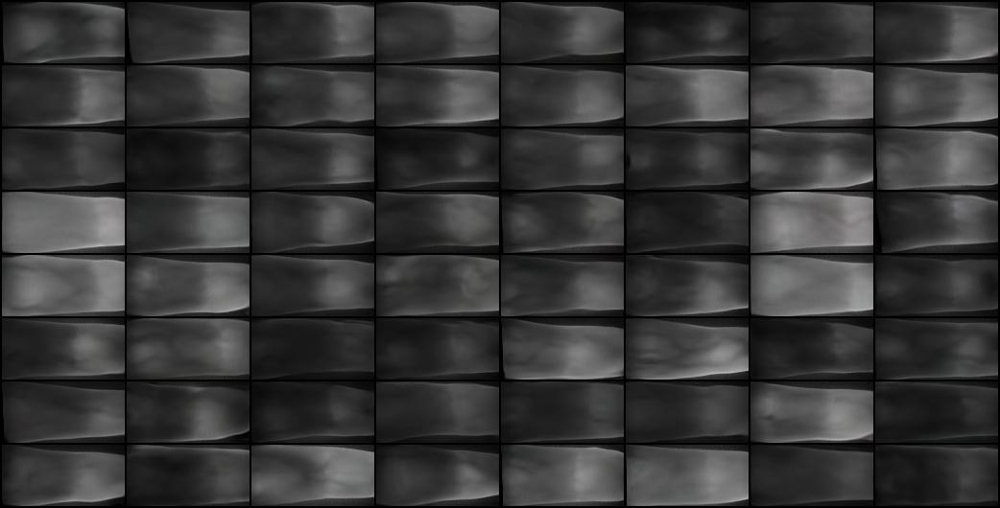
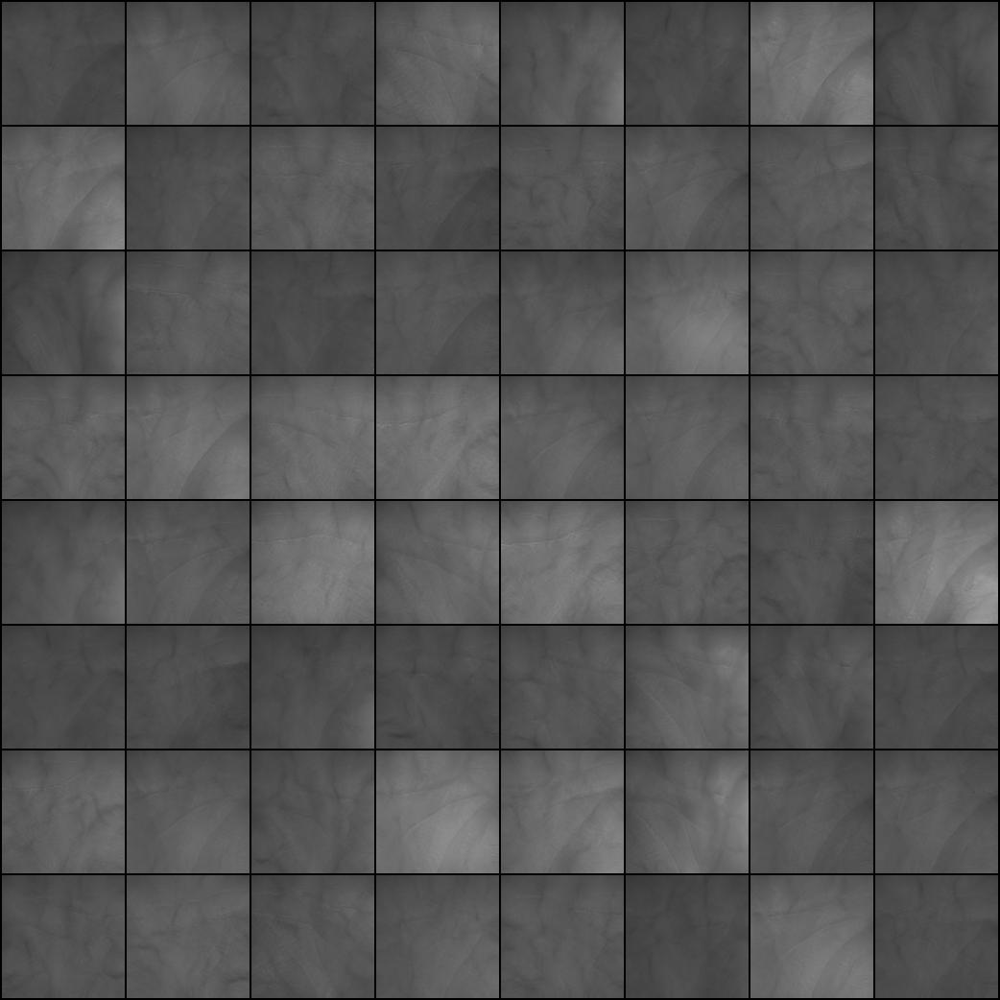

# Vein image generation

PyTorch implementation of using [stylegan2](https://github.com/NVlabs/stylegan2) for vein image generation to tackle the data shortage problem, introduced in [GSCL: Generative Self-supervised Contrastive Learning for Vein-based Biometric Verification](https://ieeexplore.ieee.org/abstract/document/10428026).

## Data preparation
Download the [preprocessed FV-USM database](https://portland-my.sharepoint.com/:u:/g/personal/weifengou2-c_my_cityu_edu_hk/EZR-zf6MCxJOikdLh5Eb7X0BeiJEiIZ6cFLRWgCFdEWf-Q?e=uOV5aE), which has been divided by a trainset and a testset. The trainset is used for training the generative models, while the testset is used for evaluating the biometric verification performance later.

## Training
### Quickstart
```bash
$ stylegan2_pytorch --data "path_to_training_data" --image-size [64,128]
```
### Specify a project name 
```bash
$ stylegan2_pytorch --data "path_to_training_data" --name fv_netcap16_bs5ac6 --image-size [64,128]
```
### More options (pls refer to [stylegan2-pytorch](https://github.com/lucidrains/stylegan2-pytorch))
```bash
$ stylegan2_pytorch --data "path_to_training_data" --name fv_netcap16_bs5ac6 --image-size [64,128] --batch-size 8 --gradient-accumulate-every 4 --network-capacity 64 --multi-gpus --calculate-fid-every 1000 --calculate-fid-num_images 2952
```

## Generate vein images with trained ckpt
You can use the script `sample_image.py` to generate arbitrary number of vein images one by one, such as
```bash
$ python sample_image.py --base-dir "path_to_base_dir" --project-name "your_project_name" --ckpt-idx 150 --num-samples 100
```

After generation, you can evaluate the FID score by
```bash
$ python -m pytorch_fid "path_to_real_vein_images" "path_to_generated_vein_images"
```

## Results
### Generated finger vein image samples 


### Generated palm vein image samples


## Acknowledgement
* The code is largely built upon the public implementation of [stylegan2-pytorch](https://github.com/lucidrains/stylegan2-pytorch). We only made necessary modifications to adapt the code to vein image data where finger vein and palm vein images usually have different aspect ratios.
* The copyright of the [FV-USM database](http://drfendi.com/fv_usm_database/) is owned by Dr. Bakhtiar Affendi Rosdi, School of Electrical and Electronic Engineering, USM.

## Citation
```bibtex
@article{ou2024gscl,
  title={GSCL: Generative Self-Supervised Contrastive Learning for Vein-Based Biometric Verification},
  author={Ou, Wei-Feng and Po, Lai-Man and Huang, Xiu-Feng and Yu, Wing-Yin and Zhao, Yu-Zhi},
  journal={IEEE Transactions on Biometrics, Behavior, and Identity Science},
  year={2024},
  publisher={IEEE}
}

@inproceedings{karras2020analyzing,
  title={Analyzing and improving the image quality of stylegan},
  author={Karras, Tero and Laine, Samuli and Aittala, Miika and Hellsten, Janne and Lehtinen, Jaakko and Aila, Timo},
  booktitle={Proceedings of the IEEE/CVF conference on computer vision and pattern recognition},
  pages={8110--8119},
  year={2020}
}

@article{asaari2014fusion,
  title={Fusion of band limited phase only correlation and width centroid contour distance for finger based biometrics},
  author={Asaari, Mohd Shahrimie Mohd and Suandi, Shahrel A and Rosdi, Bakhtiar Affendi},
  journal={Expert Systems with Applications},
  volume={41},
  number={7},
  pages={3367--3382},
  year={2014},
  publisher={Elsevier}
}
```


